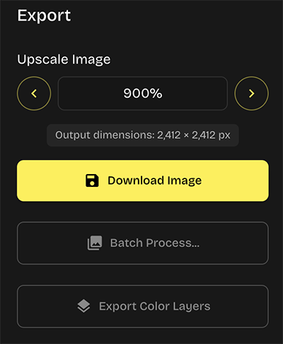
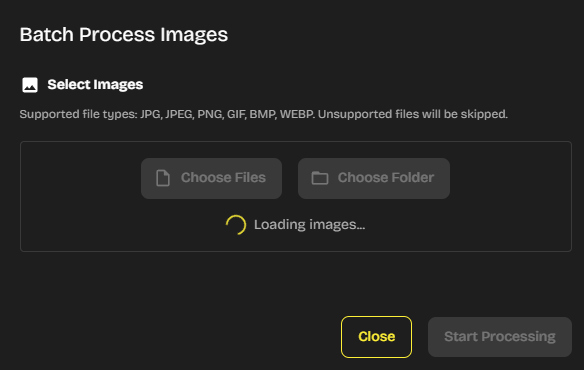

# D1TH3R1NG 4UTOM4TOR - Changelog

All notable changes to this project will be documented in this file.

The format is based on [Keep a Changelog](https://keepachangelog.com/en/1.0.0/),
and this project adheres to [Semantic Versioning](https://semver.org/spec/v2.0.0.html).

## [1.5.0] - 2025-09-19

### ✨ New Features

**Improved color extraction (for the Original Image Colors option)**
- Increased max. extracted colors from 16 to 32
- Improved the color extraction algorithm to create better/more accurate palettes based on the original image colors
- The app now uses the median cut algorithm for extracting colors, and k-means as a fallback

**Added a few color palettes**
- Added 8 new color palettes presets

### ⚙️ Maintenance
- Updated dependencies

---

## [1.4.0] - 2025-08-18

### ✨ New Features

**Automated color separation**
- Added a new "Export Color Layers" button in the Export section that automatically separates dithered images by color during export (for screen printing and other applications)

- Analyzes the final dithered image and exports individual PNG files with transparent backgrounds for each color
- Includes a reference image (all colors combined) alongside the separated layers
- Keeps upscale percentage and all other settings just like the regular single image download function
- Adds a color hex code suffix to each file for easy identification (ex. my_image_FF0000.png)
- Added instructions for this new feature in the app Documentation (Export features section)

**UI theme customization**
- Added a new Theme section in the Preferences menu to customize the app theme and the accent color
- There now are 7 themes to choose from (Darkroom, Studio, Workshop, Observatory, Factory, Atelier and Laboratory), and 9 accent colors to combine them with

### 🔧 Changes/improvements

**Ordered dithering color mapping improvements**
- Fixed "blocky" color mapping when using Bayer dithering algorithms with exactly 3 colors + Custom Palette color option
- This fix produces more detailed patterns and better color transitions

  

**Better Levels histogram**
- Improved the Levels histogram to make it more accurate
- It's now a RGB composite histogram (instead of luminance-based like before)

  

**Menu option for documentation modal**
- Added a new menu option (Help -> Documentation) to access the user guide modal directly from the app menu instead of only from the main app UI

  

**Added keyboard shortcuts list**
- Added a list of all the keyboard shortcuts of the app in the Documentation modal (Navigation & Controls section)

  

**Added FAQ section in the Documentation modal**
- Added a new FAQ with common questions/answers in the Documentation modal
- Renamed the "Tips" section to "Tips & FAQ" 

  

**Improved update notification system**
- Redesigned update checking with an improved messaging system that adapts based on update importance and timing
- Implemented a persistent update reminder on the home screen for older versions the app after support period ends to help users stay current with the latest version

  

### 🐛 Bug fixes
**Fixed scaling glitch on Updates modal**
- Fixed a visual glitch that would happen when opening and closing the "Check for Updates" modal

**Fixed color swatches overlap issue**
- Fixed color swatches overlapping with action buttons in Custom Color Presets and Custom Color Palettes modals for large palettes with a lot of swatches (the last few swatches from the first line would overlap with the Favorites button)

### ⚙️ Maintenance
- Dependencies updates

---

## [1.3.1] - 2025-08-04

### ⚙️ Maintenance
- Framework and dependencies updates

---

## [1.3.0] - 2025-08-01

### ✨ New Features

**More randomization control**
- Added "Randomization Behavior" option in Preferences (Settings menu) with three modes:
  - **Everything** (default) - Randomizes both algorithm and colors
  - **Algorithm only** - Randomizes algorithm, preserves colors  
  - **Colors only** - Randomizes colors, preserves algorithm
- Duplicate prevention ensures that consecutive clicks always produce different results

  

**"Add to favorites" button for custom presets and palettes**
- A new ♥ button for adding custom presets and color palettes to favorites (up to 20 favorites)
- Presets and palettes added to Favorites will be pinned at the top of the list
- This feature is backwards compatible - existing presets and palettes from previous versions of the app will be preserved

  

**Added undo/redo shortcuts**
- Added undo and redo keyboard shortcuts (Ctrl/Cmd + Z, Ctrl/Cmd + Shift + Z).
- Work the same way as the existing undo and redo buttons in the app UI
- Also accessible through the Edit menu

**New color palettes**
- Added 6 new color palettes presets

  

### 🔧 Changes/improvements
**Removed Ctrl/Cmd + W and Ctrl/Cmd + R accelerators**
- Removed the Ctrl/Cmd + W and Ctrl/Cmd + R keyboard shortcuts to prevent accidentally closing or reloading the app while working
- These options are still accessible from the app menu if needed

**New icons for custom patterns cards**
- Very minor update - replaced the Edit pattern and Rename pattern icons in the Custom Patterns Manager window with different ones to make them more cohesive with icons used in other sections of the app

  

**Loading indicator in Batch Process modal**
- Added a loading spinner indicator that shows up when loading files in the Batch Processor
- The spinner will appear if file loading takes longer than 500ms
- This is just a small UX improvement that prevents the modal from staying blank for a while and looking like it's frozen when loading a lot of images

  

### 🐛 **Bug Fixes**
**Fixed Joy Plot color option switching behavior**
- Fixed an issue where the color option wouldn't switch to Custom Palette when selecting the Joy Plot algorithm while the Custom Color Preset option was selected

---

## [1.2.0] - 2025-07-26

### ✨ New Features

**Canvas size limit protection**
- Added validation system to prevent corrupted image exports when upscale settings exceed browser canvas limits
- Upscale controls automatically disable when the next increment would be unsafe

**Auto-clamping resolution changes**
- When adjusting the resolution slider, the upscale percentage automatically reduces to safe values if needed
- Prevents users from getting stuck in invalid export configurations
- Shows notifications explaining when/why upscale was adjusted

This update prevents the corrupted export issue that could occur with very large upscale percentages on high resolution images.

### 🔧 Changes/improvements
**Improved license system**
- Improved reliability and responsiveness of license monitoring
- Better real time license status updates

---

## [1.1.0] - 2025-07-08

### ✨ **New Features**

#### **Auto-Sort Color Palette**
- Added auto-sort functionality for Custom Palette color swatches
- New auto-sort button (Flare Icon) next to "Current Palette" header
- Sorts colors from darkest to lightest based on luminance
- Purely cosmetic feature - no impact on dithering algorithms or color mapping
- Makes it easier to visualize color gradients and transitions in your palette
- You can click this button every time you want to clean up your palette and sort it again after adding new colors, for example

#### **Image Adjustment Reset Control**
- Added new "Behavior" tab in Preferences (Settings > Preferences/Settings)
- New preference option to control whether image adjustments (brightness, contrast, levels, etc.) are automatically reset when uploading new images
- Setting only applies when no custom preset is active - preset image adjustments are always preserved
- Option is enabled by default to maintain current behavior

### 🐛 **Bug Fixes**

#### **Sharpen Slider Improvements**
- **Fixed:** Sharpen slider positions 6-10 had no effect
- The Sharpen slider now provides progressive sharpening intensity across the full 0-10 range

---

## [1.0.0] - 2025-07-01

### Initial Release

This is the first release of D1TH3R1NG 4UTOM4TOR!

### Key Features

#### 30+ Dithering Algorithms
- **Error diffusion**: Floyd-Steinberg, Atkinson, Burkes, Sierra, and more
- **Ordered dithering**: Bayer matrices (2x2, 4x4, 8x8, 16x16)
- **Other dithering types**: 1D, frequency modulation, blue noise, pattern, clustered dot, etc.
- **Custom dithering patterns**: Create and edit your own dithering patterns

#### User Interface
- **Real time preview**: Instant preview update on your image when adjusting parameters
- **Zoom and drag-to-pan**: interactive preview canvas to get a better look at details
- **Multi-scale UI**: Support for 100%, 125%, 150%, and 200% scaling (for high DPI monitors)

#### Color Management
- **Custom palettes**: Create and manage color palettes
- **Color presets**: Built-in presets + option to create your own presets
- **Color extraction**: Automatic palette generation from images with k-means

#### Transparency Support
- **Transparency for PNG**: when you import a PNG with transparent background, transparency will be preserved
- **1-color images**: in the app, you can also create dithered images with only 1 color and a transparent background

#### Batch Processing
- **Multiple images**: Process multiple images with the same dithering settings
- **Format support**: PNG, JPG, WEBP, BMP input formats
- **High quality output**: Lossless PNG export by default

#### Dithering Pattern Editor
- **Visual editor**: Intuitive dithering pattern creation and editing
- **Multi-level patterns**: Support for complex patterns up to 10 levels (tiles)
- **Pattern library**: Save and organize custom patterns

#### Custom Presets
- Save your favorite dithering configurations in the app for future use

### Technical Specifications

#### System Requirements
- **Operating system**: Windows 10+, macOS 10.15+
- **Memory**: 4GB RAM minimum, 8GB recommended
- **Storage**: Mac: ~550mb / Windows: ~140mb available space
- **Graphics**: Hardware acceleration recommended for large images, otherwise integrated graphics is fine

#### File Support
- **Input formats**: PNG, JPG, JPEG, WEBP, BMP, GIF (no animation support for gifs though)
- **Output formats**: PNG
- **Maximum image size**: images larger than 2000px in width will be downscaled to preserve performance

### Support

- **Documentation**: User guide integrated in the app in modal form
- **General instructions**: Quick start PDF guide included
- **Updates**: Update checker in the app (Help menu)

---

**Note**: This changelog will be updated with each new release. In the app, go to Help > Check for Updates for notifications of new versions.
